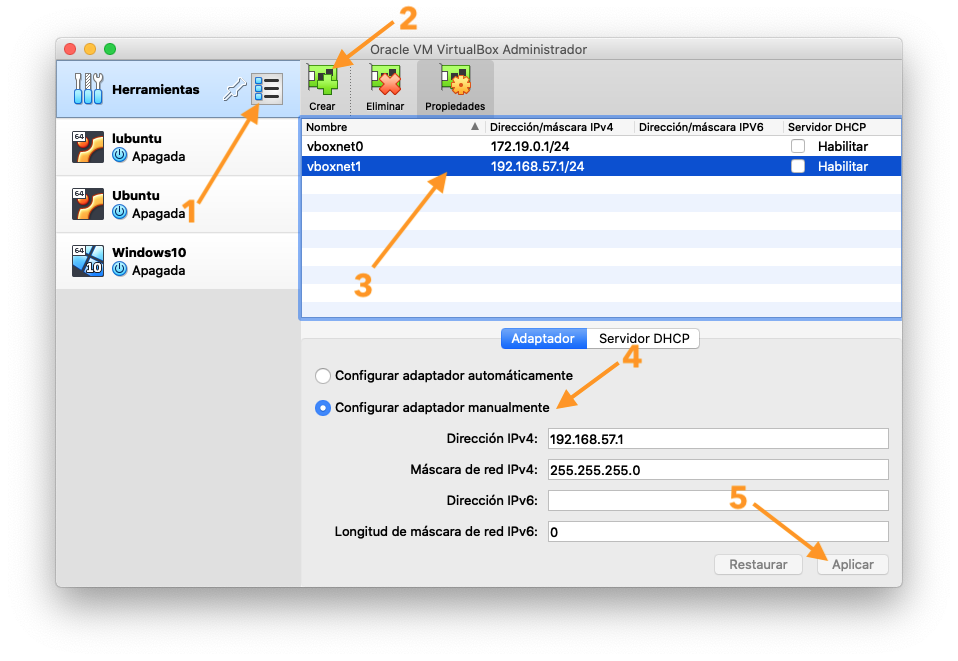
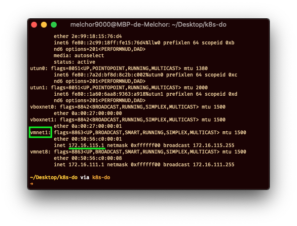

# How to create a Kubernetes cluster on Ubuntu 18.04

This is based on the [How To Create a Kubernetes Cluster Using Kubeadm on Ubuntu 18.04][1] tutorial for the [Kubernetes series][2].
This document will explain how to create the environment in your computer to create the cluster. These are the requirements:

- Windows 10, macOS 10.14 or higher, Linux
- CPU Virtualization enabled
- CPU with 4 cores or higher
- 16GB of RAM or higher
- 100GB free space somewhere
- VirtualBox, VMWare Workstation (or Fusion under macOS), qemu+KVM
- Python 3.5 or higher

You will end up with 4 VMs:

1. [pfSense][3] as gateway for your k8s cluster
2. [Ubuntu Server 18.04][4] as k8s master
2. Another [Ubuntu Server][4] as k8s worker #1
2. Another [Ubuntu Server][4] as k8s worker #2

To connect to the VMs you will use a host-only network, and the (1) VM will also be conected to the internet so it can act as gateway.

## Preparing host-only network

This section will guide you on how to prepare the network for the communication between VMs and your host. Depending on your virtualization software, steps will differ.

### VirtualBox

First you need to create the network that will be shared amongs the VMs:



1. Go to the options and select "Network" tab.
2. Create a new network, it will probably be called `vboxnet1`.
3. Select the new network `vboxnet1`.
4. Ensure "Configure adapter manually" is selected. Take not of the network configuration, it will be used next when configuring `pfSense` VM (in this example is `192.168.57.1/24`).
5. Press "Apply" if possible.

### VMWare Fusion

You don't need to create this network as it is created automatically for you. When you need to know the IP address of the network open up a terminal and issue the command `ifconfig` and look for the network `vmnet1`. It will probably be something like `172.16.115.1/24`.



### VMWare Workstation

TODO

### qemu+KVM

> This will use `virsh`-GUI to create and manage VMs

TODO

## Creating the pfSense gateway VM

First download an image of [pfSense][3] and then create a VM with the following specs:

- 1 vCPU
- 256MB of RAM or higher
- 8GB of virtual disk or higher
- Two networks interfaces:
  - The first must point to the network (it should be a bridge through your eth or WiFi conection)
  - The second must point to the created host-only network
    - VirtualBox: VM Settings > Network > Adapter 2 - Connected to _host-only adapter_ and select `vboxnet1`
    - VMWare Fusion: VM Settings > Network Adapter 2 - Select "Private for my Mac"
    - VMWare Workstation: todo
    - virsh-gui: todo

Follow the installation instructions (mainly press <kbd>\<enter></kbd>). Once you get to the home screen, which has some options to configure and manage `pfSense`, then it will be time to configure the network:

1. Select `2` _Set interface(s) IP address_.
2. Then select the option for the LAN (probably `2`).
3. It will ask you for the new LAN IP address: write the IP address of the network, but ending with 2. This is because `.1` will be reserved to your host, so the `pfSense` needs to be at `.2` or in a different IP than `.1`. Remember that the IP address was obtained in the [Preparing host-only network](#preparing-host-only-network) step.
4. Then it will ask you to write the network mask: write `24`.
5. For the next question (about an upstream gateway address), just press enter.
6. For IPv6, if you want to fill something, do it. I just skipped this by pressing enter.
7. Next question is about DHCP server, we need one so write `y` and press enter.
8. The start address for the DHCP pool can start at `.3` (eg.: `172.16.115.3`). Write the IP and press enter.
9. The end address for the DHCP pool can be `.254` (eg.: `172.16.115.254`). Write the IP and press enter.
10. If you get asked for something of `webConfiguration` say YES (and press enter).
11. Now you may go to the `.2` IP (the pfSense IP address in the host-only network) to configure further stuff if you like.
12. Ensure that the WAN interface has internet connectivity and everything is configured properly. If you need to configure the IP with an static one, start pressing `2` option again but this time configure it for `1` WAN. Do not forget to set an _upstream gateway address_ or no internet will be.

## Creating the Ubuntu VMs

First download an image of [Ubuntu Server 18.04][4] and then create three VMs with the following specs:

- 2 vCPU
- 2GB of RAM or higher
- 10 GB of virtual disk or higher (recommended 20GB)
- One network interface pointing to the _host-only_ network

Install Ubuntu Server with default settings. Give each VM a different hostname to identify them. When configuring, enable SSH server and, if possible, import an SSH key. Do not add docker nor k8s in the software screen.

> Note: the k8s master node, the non-root user that matches the playbook is called `k8s-master`.

Sometimes, for some reason, it does not properly configure the network after DHCP and no internet is available. This can happen when configuring the network (continue button with text _Continue without network_) or after installation. If you get this error, open a shell (<kbd>Ctrl+Alt+F2</kbd> in installation media) and issue the following commands:

```sh
ip a
ip l set <net_if> down
ip l set <net_if> up
netplan apply
ping 1.1.1.1 # whatever server
```

If the VMs does not have an SSH key, then provide one for the non-admin user. When the user has an SSH key, copy the `authorized_keys` file to `/root/.ssh` so you may login as `root` with the same key:

```sh
sudo cp -p ~/.ssh/authorized_keys /root/.ssh
sudo chown root:root /root/.ssh/authorized_keys
```

Also remove the swap from the system, kubernetes won't start if swap is enabled:

```sh
sudo swapoff /swap.img
sudo vim /etc/fstab # remove the swap from fstab
sudo rm /swap.imf
```

## Start deploying your kubernetes cluster

For this you will need [ansible][5] installed on your host either as global package or in a virtual environment. Follow the [DigialOcean guide][1] steps but ignoring the first one which creates an user (we already have one).

Check the playbook `2-master.yml` which has some user related tasks. Edit it to match your setup. Also check the `hosts` file to edit the IPs to match as well.

Happy deployment :)

### Troubleshooting

**My cluster initialization failed :s**

Read carefully what is saying in your terminal, and remove one file from the master VM: `rm /root/cluster_initialized.txt`

**Flannel installation failed :c**

Read carefully the terminal, also it may be good to read `~/pod_network_setup.txt` file in the VM. But before running the playbook again, remove the `txt` file.

**The cluster is stuck in `NotReady`. What should I do?**

StackOverflow may save you: <https://stackoverflow.com/questions/47107117/how-to-debug-when-kubernetes-nodes-are-in-not-ready-state>

In my case, flannel was not installed properly and I run the installation manually and fixed it up.

  [1]: https://www.digitalocean.com/community/tutorials/how-to-create-a-kubernetes-cluster-using-kubeadm-on-ubuntu-18-04
  [2]: https://www.digitalocean.com/community/curriculums/kubernetes-for-full-stack-developers
  [3]: https://www.pfsense.org
  [4]: https://ubuntu.com/download/server
  [5]: https://www.ansible.com
